# 🍬 Sweet Shop Management System

This repository documentation covers **Frontend** of the Sweet Shop Management System. Each section includes project explanation, local setup instructions, screenshots, **My AI Usage**, and Future Scope.

---

# 📘 Frontend

## 📌 Project Overview
The **Sweet Shop Management System Frontend** is a web-based user interface that allows users to interact with the Sweet Shop Management backend services. It provides features such as managing sweets, viewing inventory, and performing shop-related operations through a clean and responsive UI.

The frontend communicates with the backend via REST APIs and focuses on usability, responsiveness, and clarity.

---

## 🛠️ Tech Stack
- **Framework:** React.js
- **Language:** JavaScript
- **Styling:** TailwindCSS, CSS
- **Package Manager:** npm

---

## ⚙️ Setup & Run Instructions (Frontend)

### Prerequisites
Make sure you have the following installed:
- Node.js
- npm (comes with Node.js)
- Git

### Clone the Repository
```bash
git clone https://github.com/HenishSoliya/sweet-shop-management-frontend.git
cd sweet-shop-management-frontend
```

### Update API Endpoints
Change `BASE_URL` in `./src/config/api.js` if required. <br>
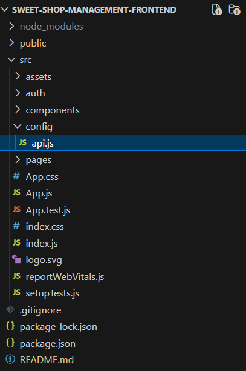 <br>
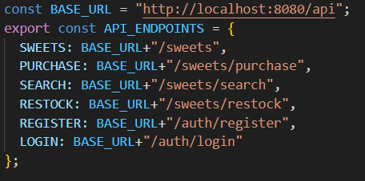

### Install Dependencies
```bash
npm install
```

### Run the Application Locally
```bash
npm start
```

The frontend application will start on: `http://localhost:3000`

> ⚠️ Ensure the backend server is running so API requests work correctly.

---

## 🖼️ Screenshots

1. Register and Login Page <br>
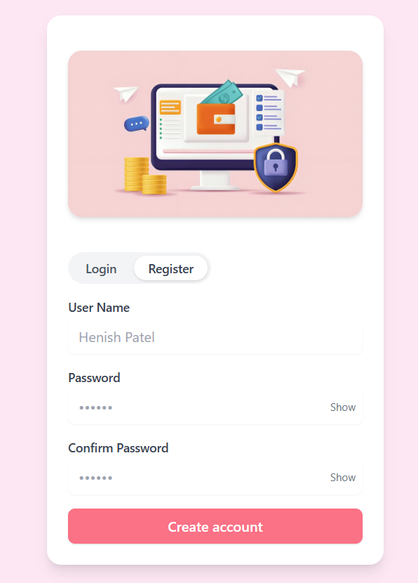
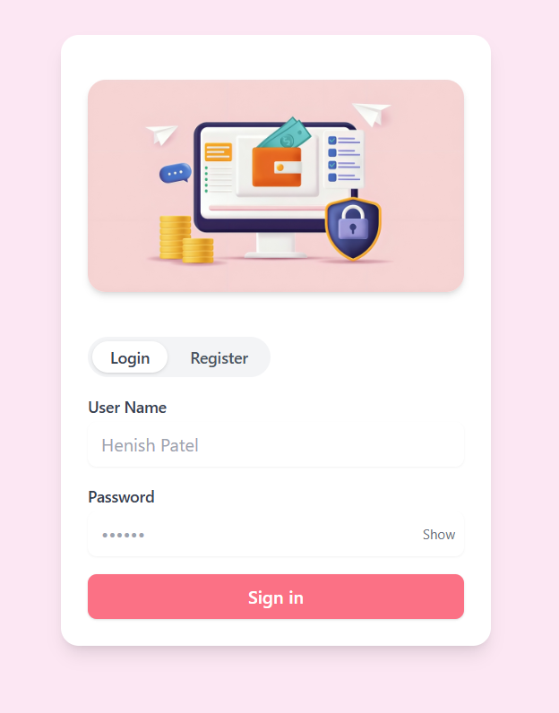

2. USER Dashboard <br>
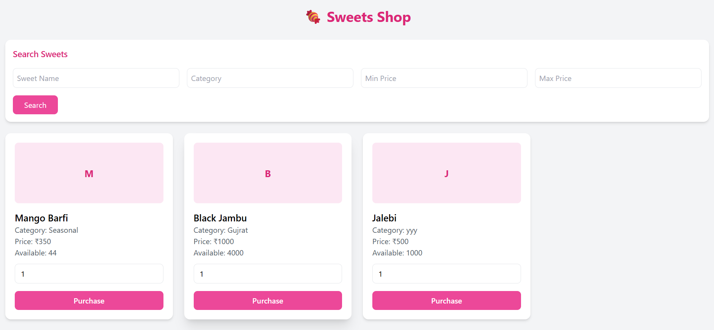
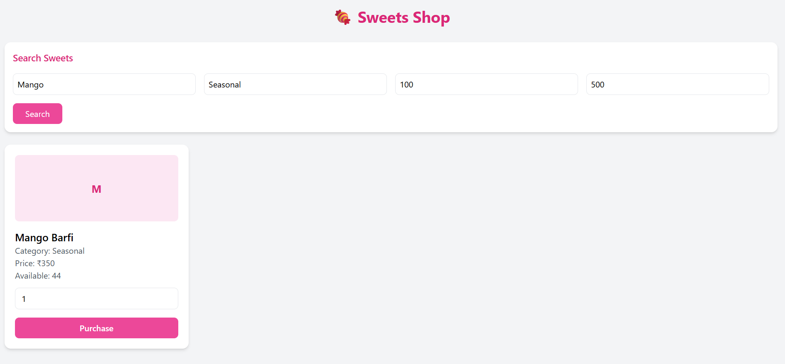
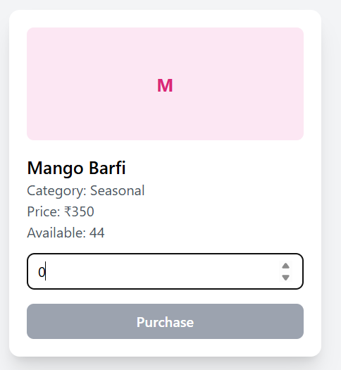
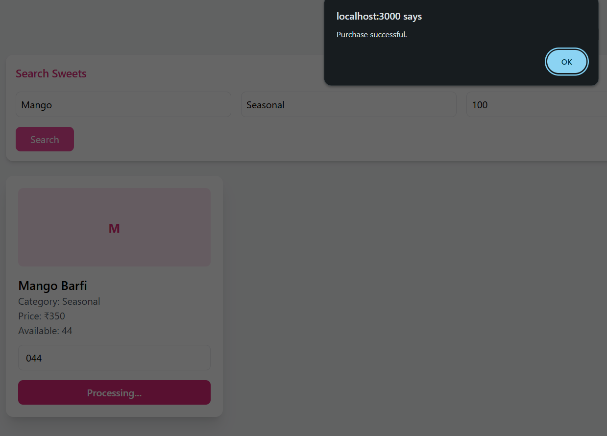
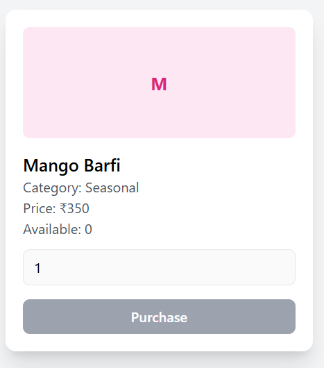

3. ADMIN Dashboard <br>
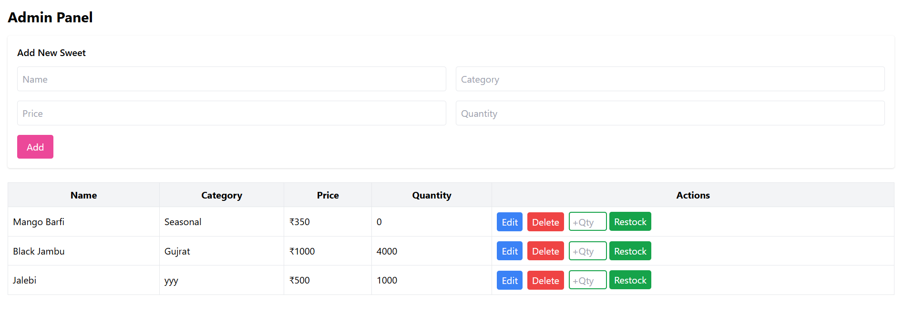
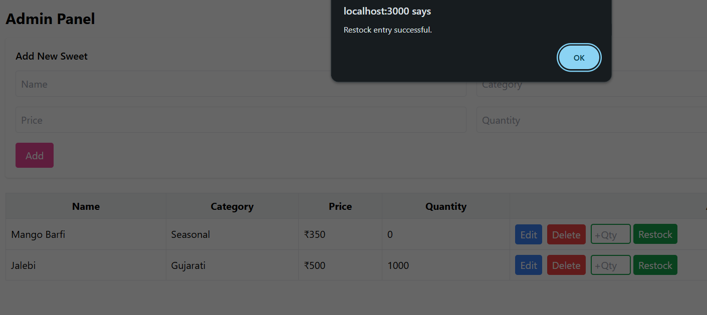
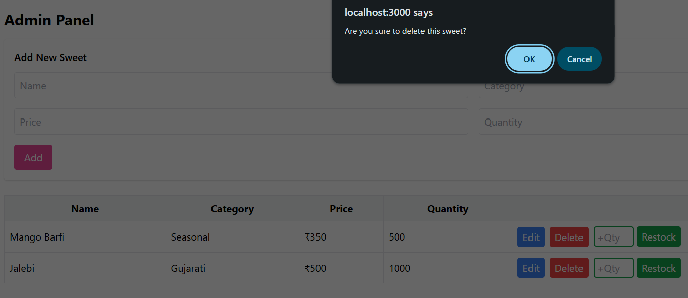

---

## 🤖 My AI Usage

### AI Tools Used
- **ChatGPT**

### How I Used Them
- Used ChatGPT to understand React concepts and component structuring.
- Take help of ChatGPT for make Good looking UI.
- Used ChatGPT to assist in writing this README documentation.

### Reflection on AI Impact
Using ChatGPT significantly improved my development workflow by reducing the time spent searching for solutions and documentation. It helped me better understand frontend best practices, debug issues faster, and stay productive throughout development. AI acted as a supportive learning and productivity tool rather than a replacement for core development effort.

---

## 🚀 Future Scope

The frontend of the Sweet Shop Management System can be enhanced in the future with the following improvements:

* Improved UI/UX: Enhance the user interface with modern design systems, animations, and better accessibility support.
* Form Validation & Error Handling: Add advanced client-side validation and user-friendly error messages.
* Performance Optimization: Optimize component rendering and API calls to improve application performance.